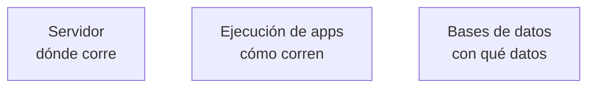
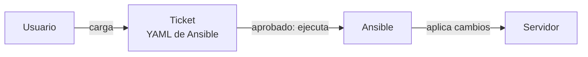
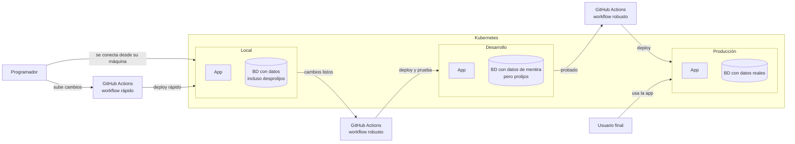
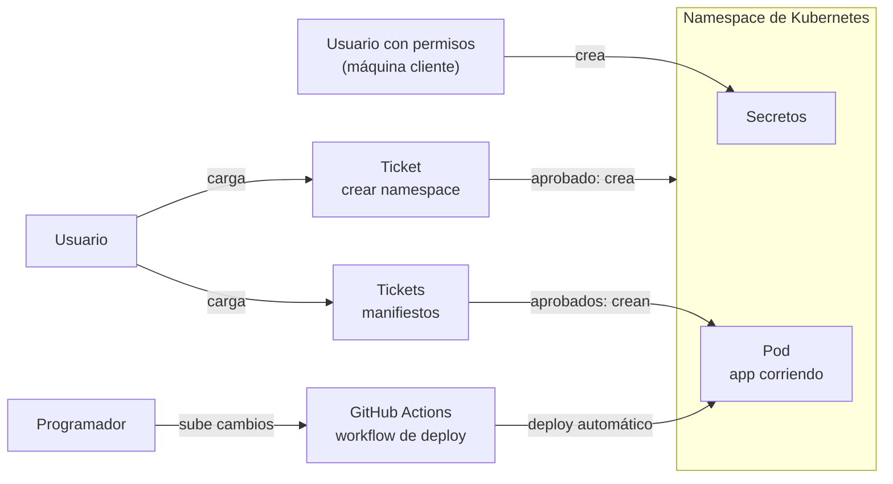
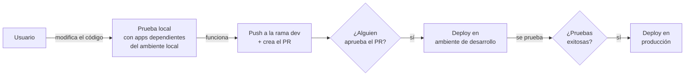
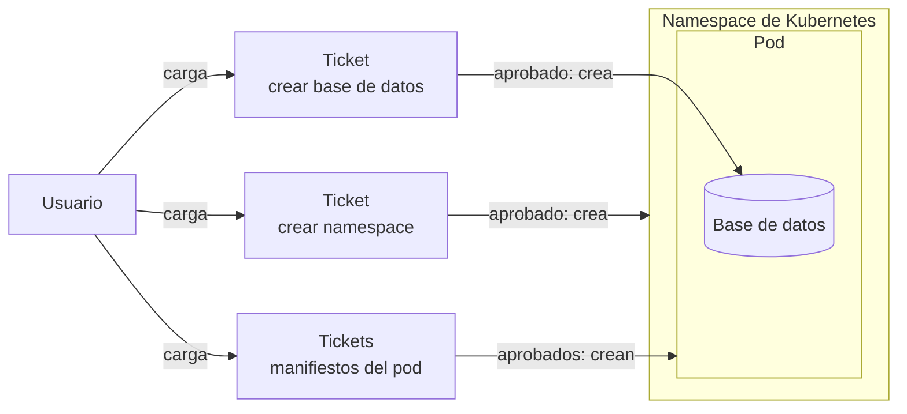
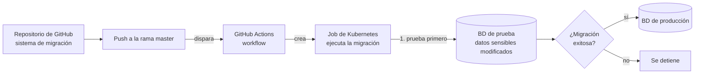
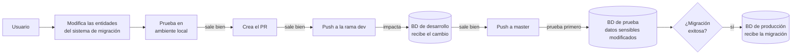

# El problema: la bola de nieve

Muchas empresas chicas arrancan sin un entorno de desarrollo definido. El desarrollo crece con malas prácticas, como una bola de nieve que baja por la montaña, y aparecen problemas como:

- **"En mi máquina funciona"**: cada dev prueba en su PC y nadie sabe qué versión anda dónde.
- **Probar en producción**: sin un lugar donde equivocarse, los errores los pagan los usuarios.
- **Servidores artesanales**: máquinas configuradas a mano que nadie sabe recrear.
- **Bases de datos sin historia**: cambios a mano, sin registro, imposibles de clonar o recrear.
- **Despliegues manuales y riesgosos**: dependen de una persona que "sabe cómo se hace".
- **Dependencia de personas**: lo que no está en procesos se va cuando la persona se va.

# Nuestra propuesta

Ayudar a las empresas a armar un entorno de desarrollo con tres piezas (servidor, herramienta de ejecución y bases de datos), cada una gestionada con procesos definidos. La implementación se haría a medida para una empresa específica.

El entorno no corrige las malas prácticas por sí solo. Da el lugar y la estructura para que los procesos existan, pero si el equipo sigue haciendo cambios a mano fuera de él, la bola de nieve sigue rodando. Lo que lo hace efectivo es que todo cambio pase por procesos definidos.

Un ejemplo de gestión automatizada sería el que describimos a partir de aquí.

# Las 3 piezas de un entorno de desarrollo

Un entorno de desarrollo es donde un equipo construye, prueba y ejecuta sus apps con un riesgo mínimo para producción. Para que sea prolijo, necesita tres piezas, y cada una debe estar gestionada con procesos definidos.

1. **Servidor**: la máquina donde corre el entorno, con CPU, memoria y red.
   - Ejemplos: una VM en la nube, un servidor físico, una PC dedicada.
   - Gestión: crearlo, actualizarlo, asegurarlo y monitorear sus recursos.
2. **Herramienta de ejecución**: lo que levanta y mantiene corriendo las apps.
   - Ejemplos: Kubernetes, Docker Compose.
   - Gestión: desplegar versiones nuevas, reiniciar apps que fallan, escalarlas y revisar sus logs.
3. **Bases de datos**: donde las apps guardan la información.
   - Ejemplos: PostgreSQL, MySQL, MongoDB.
   - Gestión: crear, modificar y dar de baja bases de datos, migrar esquemas, hacer backups y recrearlas o clonarlas con datos de prueba.

Estas tres piezas aplican a apps de servidor que guardan datos, por ejemplo:

- Backends y APIs (REST, GraphQL).
- Aplicaciones web con usuarios y sesiones: un e-commerce, un sistema de tickets, un ERP.
- Sistemas de varios servicios o microservicios que se comunican entre sí.

# Proceso de gestión de servidores

Los cambios en un servidor no se hacen a mano: pasan por un ticket.

1. El usuario carga un ticket. Además de los campos habituales, el ticket tiene un campo para un código YAML de Ansible.
2. El ticket se crea en estado **OPEN** y queda asignado a un aprobador, por ejemplo un líder técnico o un gerente.
3. Cuando el aprobador lo aprueba, comienza la ejecución automática: se corre ese código Ansible de forma remota sobre el servidor.
4. Queda registrado quién pidió el cambio, quién lo aprobó y qué se hizo en el servidor.
5. Como todo cambio queda registrado, una IA puede consultar ese historial mediante un MCP y saber qué tiene instalado y configurado el servidor. Con eso puede indicar qué falta para desarrollar una feature determinada.

**Ansible** es una herramienta que gestiona servidores de forma remota: permite instalar y configurar software y, en general, todo lo relacionado con el servidor.

**MCP** (Model Context Protocol) es un estándar abierto que permite a una IA conectarse a sistemas y datos externos para consultarlos o usarlos como herramientas. En este caso, le permite leer el historial de tickets y ejecuciones.

# Ambientes en Kubernetes

Un ambiente es una copia separada del sistema con su propio propósito. En Kubernetes habría tres:

1. **Producción**: donde el usuario final utiliza la app. La app se despliega con un workflow de GitHub Actions robusto.
2. **Desarrollo**: donde se prueba la app antes de desplegarla en producción. También se despliega con un workflow de GitHub Actions robusto. Su base de datos tiene datos de mentira, pero prolijos.
3. **Local**: donde el programador se conecta desde su máquina local. El workflow de GitHub Actions se ejecuta rápido. Su base de datos tiene datos que pueden ser incluso desprolijos.

# Ejecución de la app: primer desarrollo

La ejecución de las apps también se gestiona con tickets y de forma automática.

1. El usuario carga un ticket para crear un namespace de Kubernetes. Cuando el ticket se aprueba, el namespace se crea automáticamente.
2. Si hacen falta secretos en el namespace, se crean con un usuario con permisos para ello, desde una máquina cliente.
3. El usuario carga los tickets necesarios para ejecutar los manifiestos que crean un pod de forma automática.
4. Las variables de entorno que no son secretos van escritas directamente en los manifiestos.
5. Se desarrolla la app, por ejemplo un backend.
6. Se desarrolla el workflow de GitHub Actions que despliega la app en el pod de forma automática.
7. Desde ese momento, cada vez que el programador crea una feature o modifica algo, el deploy y la ejecución de la app se hacen automáticamente.

**Kubernetes** es una plataforma que ejecuta y administra aplicaciones en contenedores: las levanta, las reinicia si fallan y permite escalarlas.

**Namespace** es un espacio aislado dentro de Kubernetes que agrupa recursos (pods, secretos, configuración), para separar apps o entornos entre sí.

**Pod** es la unidad mínima de ejecución en Kubernetes: contiene uno o más contenedores con la app corriendo.

**GitHub Actions** es el sistema de automatización de GitHub: ejecuta workflows definidos en el repositorio, por ejemplo desplegar la app cada vez que cambia el código.

# Ejecución de la app: modificación de un desarrollo existente

1. El usuario modifica el código de la app, la prueba localmente y se conecta con las apps dependientes que están en el ambiente local de Kubernetes para probar.
2. Cuando funciona, hace un push a la rama dev y crea el PR.
3. Cuando alguien aprueba el PR, la app se despliega en el ambiente de desarrollo.
4. Se hacen las pruebas en el ambiente de desarrollo.
5. Si todo sale bien, se despliega en producción.

**PR (Pull Request)** es una solicitud para incorporar los cambios de una rama a otra. Permite que otra persona los revise y los apruebe antes de que se integren.

**Rama dev** es la rama del repositorio donde se integran los cambios que van a probarse en el ambiente de desarrollo, antes de llegar a producción.

**Deployar** (desplegar) es publicar una versión de la app en un ambiente para que quede corriendo.

# Base de datos: primer desarrollo

Igual que los servidores y las apps, la base de datos se crea y se cambia mediante tickets y automatización.

**Preparación de la base de datos**

1. El usuario carga un ticket para crear el namespace. Cuando se aprueba, se crea automáticamente.
2. El usuario carga los tickets para ejecutar los manifiestos y todo lo necesario para crear el pod donde estará la base de datos.
3. El usuario carga un ticket para crear la base de datos dentro del namespace y el pod ya creados.

**Cambios sobre la base de datos (migraciones)**

4. El usuario desarrolla un sistema de migración. Ahí define las entities que representan las tablas y la conexión a la base de datos. Los datos de conexión ya se obtuvieron en los pasos anteriores. El sistema se deja en un repositorio de GitHub.
5. El usuario crea el workflow de GitHub Actions para que, al hacer push en la rama master, se cree automáticamente un job en Kubernetes y ahí se ejecute el sistema de migración.
6. Ese proceso primero prueba la migración contra una base de datos de prueba, muy parecida a la de producción pero con los datos sensibles modificados: por ejemplo, todas las claves iguales o los teléfonos aleatorios. Esa base solo sirve para probar que la migración funciona.
7. Si todo sale bien, el proceso automático recién ahí ejecuta la migración en producción.

**Sistema de migración** es el código que define la estructura de la base de datos (tablas, columnas) y aplica los cambios sobre ella de forma ordenada y registrada, en lugar de hacerlos a mano.

**Push** es subir al repositorio remoto (GitHub) los cambios hechos localmente.

**Rama master** es la rama principal del repositorio. Lo que llega a ella se considera listo para producción, por eso dispara el proceso automático.

**Job** es un recurso de Kubernetes que ejecuta una tarea puntual hasta que termina, a diferencia de un pod de una app, que queda corriendo. Acá ejecuta el sistema de migración.

# Base de datos: modificación de un desarrollo existente

1. Se hace la modificación en las entidades del sistema de migración.
2. Se prueba en el ambiente local.
3. Si todo sale bien, se crea el PR.
4. Si todo sale bien, se hace push a la rama dev para impactar el cambio en la base de datos de desarrollo.
5. Si todo sale bien, se hace push a master para impactar la migración en la base de datos de producción.
6. Antes de impactar en producción, el proceso automático prueba la migración contra la base de datos de prueba. Solo si sale bien, migra producción.

**Entidad** es una clase del código que representa una tabla de la base de datos. Modificarla (por ejemplo, agregar un campo) es lo que define el cambio que la migración aplica.

# wiki-hub

Documentación del entorno de trabajo `jtagram`: un servidor (`pcbox`) con MicroK8s, los 7 repositorios de la organización, y las 5 apps que corren ahí (`iam`, `iam-api`, `ticket-hub`, `ticket-hub-api`, `infra-hub-api`). Elegí qué necesitás:

1. [`montar-desde-cero/montar-desde-cero.md`](montar-desde-cero/montar-desde-cero.md) — Montar todo el ecosistema desde cero, paso a paso.
2. [`arquitectura/arquitectura.flujo-deploy.md`](arquitectura/arquitectura.flujo-deploy.md) — Entender el flujo de deploy.
3. [`arquitectura/arquitectura.usuario-interno.md`](arquitectura/arquitectura.usuario-interno.md) — Entender qué es un usuario interno y su flujo de acceso.
4. [`arquitectura/arquitectura.usuario-aplicacion.md`](arquitectura/arquitectura.usuario-aplicacion.md) — Entender qué es un usuario de aplicación y su flujo.
5. [`arquitectura/arquitectura.ticketeras.md`](arquitectura/arquitectura.ticketeras.md) — Entender qué resuelve cada ticketera, del formulario a `pcbox`.
