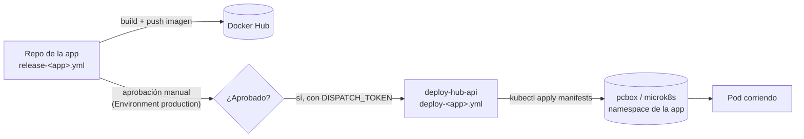

# Cómo funciona el flujo de deploy

Cada una de las 5 apps se despliega en dos etapas separadas por una aprobación manual: el repo de la app compila y publica su propia imagen en Docker Hub y, recién después de que alguien apruebe el Environment `production`, dispara — con un token dedicado — el workflow de `deploy-hub-api` que aplica los manifiestos de esa app contra el cluster de `pcbox`.

