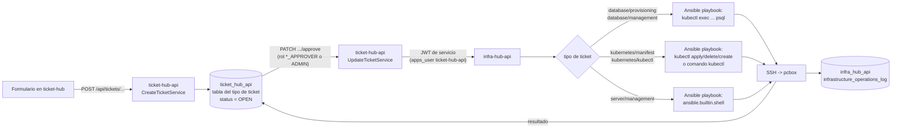

# Qué resuelve cada ticketera

`ticket-hub` tiene 5 formularios de ticket, cada uno con su propio flujo de aprobación en `ticket-hub-api`: `database/provisioning` (crear una base de datos nueva en un deployment de Postgres), `database/management` (ejecutar un SQL arbitrario contra una base existente), `kubernetes/manifest` (aplicar/borrar/crear un manifiesto de Kubernetes con `kubectl`), `kubernetes/kubectl` (ejecutar un comando `kubectl` arbitrario) y `server/management` (ejecutar un comando de shell arbitrario en el servidor). Ninguno se ejecuta al crearse: el ticket queda en estado `OPEN`, guardado en su propia tabla, hasta que alguien con el rol aprobador correspondiente (`DATABASE_APPROVER`, `KUBERNATES_APPROVER`, `SERVER_APPROVER` o `ADMIN`) lo aprueba o lo rechaza por `PATCH .../:number/approve` o `.../reject` — un ticket ya aprobado o rechazado no se puede volver a tocar. Solo al aprobarse, `ticket-hub-api` llama a `infra-hub-api` autenticándose como el usuario de aplicación `ticket-hub-api` (ver `arquitectura.usuario-aplicacion.md`), pasándole los datos del ticket. `infra-hub-api` nunca ejecuta nada directo contra `pcbox`: **todas** las operaciones — incluidas las de Kubernetes — se traducen a un playbook de Ansible que corre por SSH contra `pcbox` (credenciales del Secret `server-ssh-key`: `SERVER_SSH_HOST`/`SERVER_SSH_USER`/`SERVER_SSH_PRIVATE_KEY`). Lo que cambia entre ticketeras no es el transporte (siempre `ansible-playbook` por SSH) sino qué tarea lleva el playbook: los tickets de base de datos y de manifiesto/kubectl construyen una tarea `ansible.builtin.command` que corre `kubectl` (con `exec ... psql` para SQL, o `kubectl apply/delete/create`/el comando `kubectl` tal cual para los de Kubernetes) en `pcbox`, mientras que `server/management` corre el comando recibido directo con `ansible.builtin.shell`. El resultado de la ejecución se guarda en `infrastructure_operations_log` y también se copia como `response` en el ticket original.

