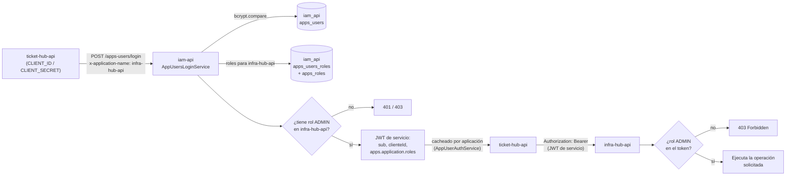

# Qué es un usuario de aplicación

Un "usuario de aplicación" (tabla `apps_users` en la base `iam_api`, distinta de `internal_users`) no es una persona sino un servicio que necesita hablar con otra API en nombre propio. Se identifica con `cliente_id`/`cliente_secret` en vez de email/password, y el caso real que existe hoy en el sistema es `ticket-hub-api`: tiene su propio registro en `apps_users` (`cliente_id = 'ticket-hub-api'`) con rol `ADMIN` asignado en `apps_users_roles` tanto para `infra-hub-api` como para `ticket-hub` (ver `wiki-hub/database/database.datos-iniciales.md`), y sus credenciales viven en el Secret de Kubernetes `ticket-hub-api-service-credentials` (`CLIENT_ID`/`CLIENT_SECRET`). El login es un client-credentials clásico contra el mismo endpoint que usan los usuarios internos por diseño espejado: `POST /apps-users/login` en `iam-api`, con `clienteId`/`clienteSecret` en el body y el mismo header `x-application-name` para indicar contra qué aplicación quiere el token. `iam-api` compara el secreto con bcrypt contra `apps_users.cliente_secret`, resuelve los roles en `apps_users_roles` para esa aplicación, y emite un JWT con `sub` (id), `clienteId` y el mismo claim `apps.application.roles` que en el flujo de usuario interno — la única diferencia real de contenido es `clienteId` en vez de `email`. En la práctica, el `AppUserAuthService` de `ticket-hub-api` pide y cachea ese JWT (por aplicación destino, renovándolo antes de que expire) y lo adjunta como `Authorization: Bearer` en cada llamada a `infra-hub-api`, que a su vez valida el token y exige rol `ADMIN` en sus propios endpoints.

