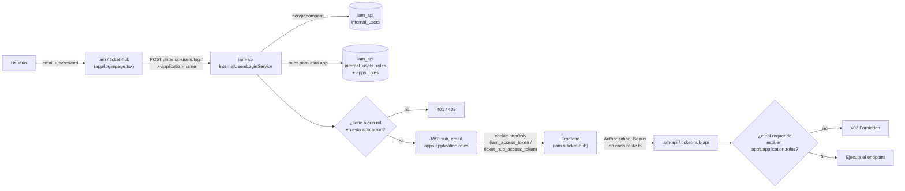

# Qué es un usuario interno

Un "usuario interno" es una persona (tabla `internal_users` en la base `iam_api`) que se logea con email y contraseña desde `iam` o desde `ticket-hub`. El login lo resuelve siempre `iam-api`: `POST /internal-users/login` recibe `email`/`password` en el body y un header `x-application-name` (que cada frontend manda con su propio nombre — `iam` o `ticket-hub`, tal como están cargados en `apps_applications`), valida la contraseña con bcrypt y busca en `internal_users_roles` los roles que ese usuario tiene asignados **para esa aplicación puntual**, cruzando con `apps_roles`. Si no tiene ningún rol asignado para esa aplicación, el login se rechaza aunque la contraseña sea correcta. Con eso arma un JWT con claims `sub` (id), `email`, y `apps.application` (`id`, `name`, `description` y el array `roles` con los roles resueltos). Cada frontend guarda ese JWT en una cookie httpOnly propia (`iam_access_token` en `iam`, `ticket_hub_access_token` en `ticket-hub` — mismo mecanismo, dos cookies distintas) y de ahí en adelante cada ruta `route.ts` del frontend la lee y la reenvía como header `Authorization: Bearer` a la API correspondiente (`iam-api` o `ticket-hub-api`), que la valida con su propio guard de JWT y compara los roles del claim `apps.application.roles` contra el rol que exige cada endpoint — por eso un ADMIN de `ticket-hub` no sirve como ADMIN de `iam`: son roles con el mismo nombre pero emitidos para aplicaciones distintas.

