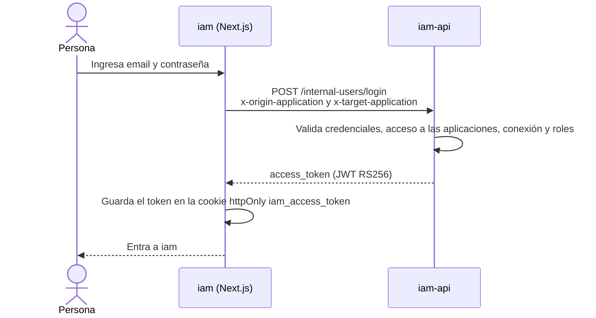
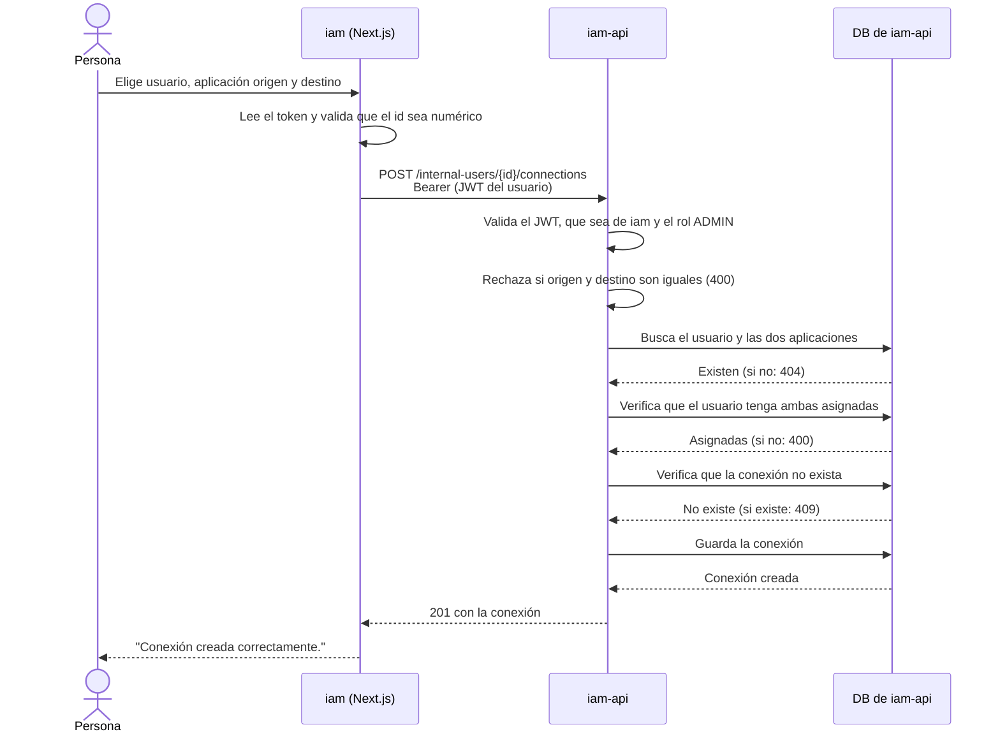

# Relacionar aplicaciones para usuarios internos

## Login

```mermaid
sequenceDiagram
    actor U as Persona
    participant UI as iam (Next.js)
    participant API as iam-api

    U->>UI: Ingresa email y contraseña
    UI->>API: POST /internal-users/login<br/>x-origin-application y x-target-application
    API->>API: Valida credenciales, acceso a las aplicaciones, conexión y roles
    API-->>UI: access_token (JWT RS256)
    UI->>UI: Guarda el token en la cookie httpOnly iam_access_token
    UI-->>U: Entra a iam
```

## Relacionar aplicaciones

```mermaid
sequenceDiagram
    actor U as Persona
    participant UI as iam (Next.js)
    participant API as iam-api
    participant DB as DB de iam-api

    U->>UI: Elige usuario, aplicación origen y destino
    UI->>UI: Lee el token y valida que el id sea numérico
    UI->>API: POST /internal-users/{id}/connections<br/>Bearer (JWT del usuario)
    API->>API: Valida el JWT, que sea de iam y el rol ADMIN
    API->>API: Rechaza si origen y destino son iguales (400)
    API->>DB: Busca el usuario y las dos aplicaciones
    DB-->>API: Existen (si no: 404)
    API->>DB: Verifica que el usuario tenga ambas asignadas
    DB-->>API: Asignadas (si no: 400)
    API->>DB: Verifica que la conexión no exista
    DB-->>API: No existe (si existe: 409)
    API->>DB: Guarda la conexión
    DB-->>API: Conexión creada
    API-->>UI: 201 con la conexión
    UI-->>U: "Conexión creada correctamente."
```

<a href="iam.md">← Back</a>

