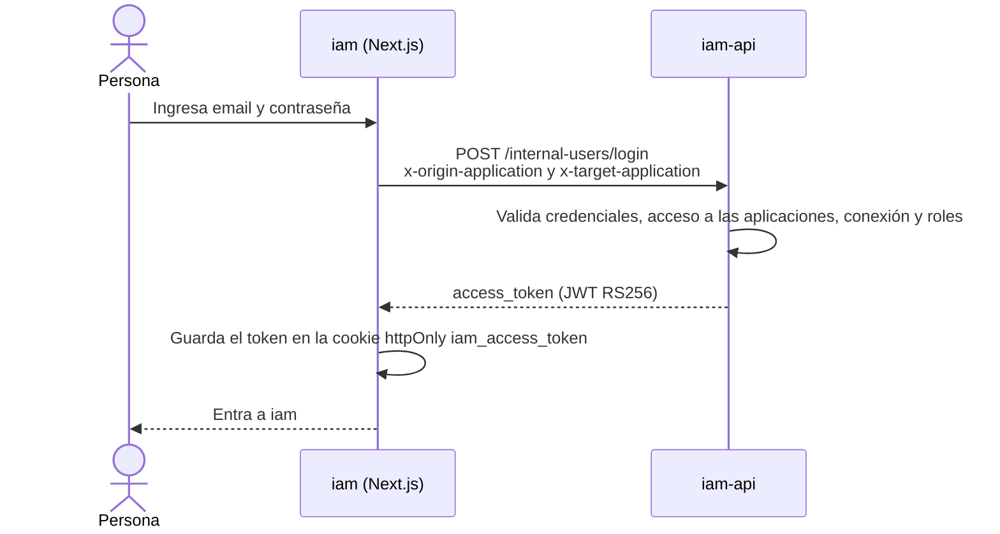
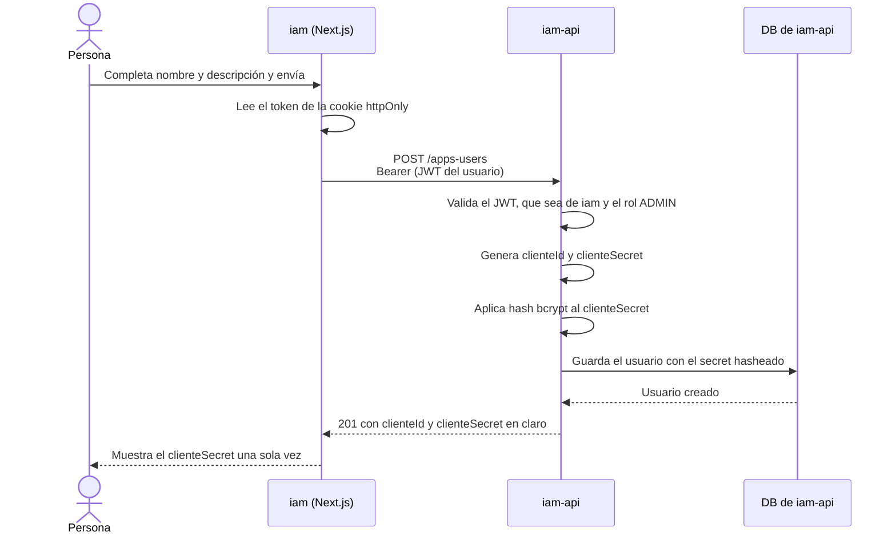

# Crear usuario de aplicación

## Login

```mermaid
sequenceDiagram
    actor U as Persona
    participant UI as iam (Next.js)
    participant API as iam-api

    U->>UI: Ingresa email y contraseña
    UI->>API: POST /internal-users/login<br/>x-origin-application y x-target-application
    API->>API: Valida credenciales, acceso a las aplicaciones, conexión y roles
    API-->>UI: access_token (JWT RS256)
    UI->>UI: Guarda el token en la cookie httpOnly iam_access_token
    UI-->>U: Entra a iam
```

## Crear usuario de aplicación

```mermaid
sequenceDiagram
    actor U as Persona
    participant UI as iam (Next.js)
    participant API as iam-api
    participant DB as DB de iam-api

    U->>UI: Completa nombre y descripción y envía
    UI->>UI: Lee el token de la cookie httpOnly
    UI->>API: POST /apps-users<br/>Bearer (JWT del usuario)
    API->>API: Valida el JWT, que sea de iam y el rol ADMIN
    API->>API: Genera clienteId y clienteSecret
    API->>API: Aplica hash bcrypt al clienteSecret
    API->>DB: Guarda el usuario con el secret hasheado
    DB-->>API: Usuario creado
    API-->>UI: 201 con clienteId y clienteSecret en claro
    UI-->>U: Muestra el clienteSecret una sola vez
```

<a href="../../operation.md">← Back</a>

