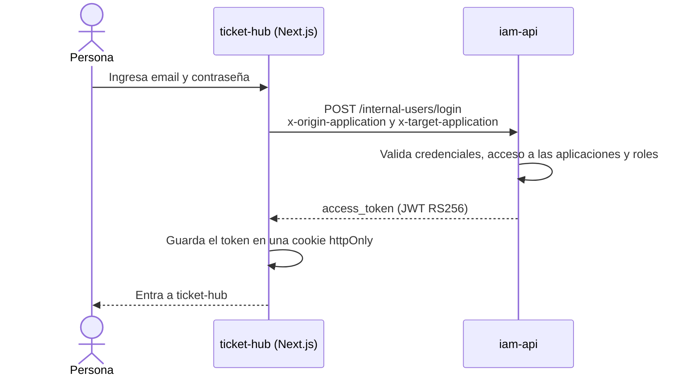
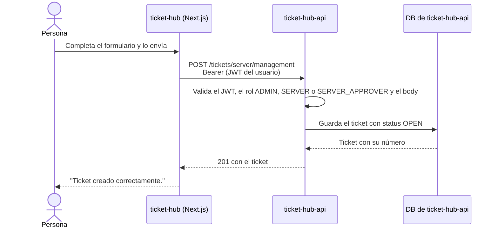
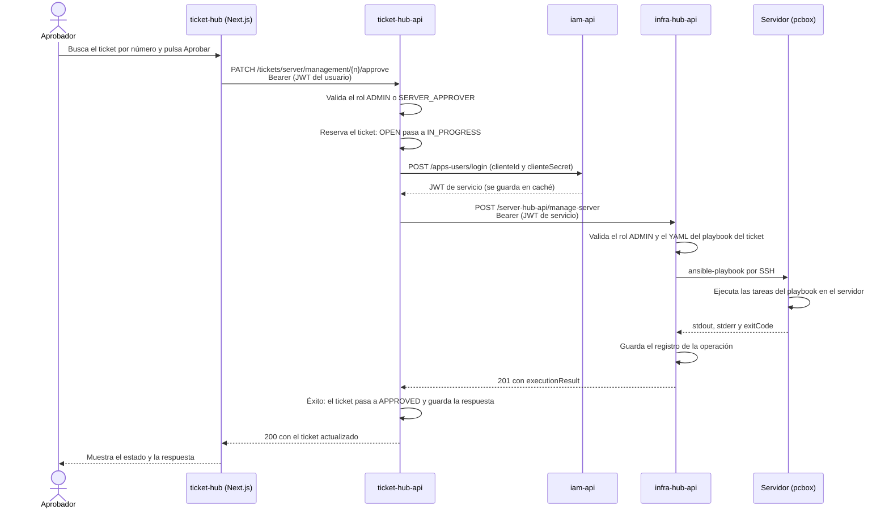

# Solicitar gestión de servidor

## Login

```mermaid
sequenceDiagram
    actor U as Persona
    participant TH as ticket-hub (Next.js)
    participant IAM as iam-api

    U->>TH: Ingresa email y contraseña
    TH->>IAM: POST /internal-users/login<br/>x-origin-application y x-target-application
    IAM->>IAM: Valida credenciales, acceso a las aplicaciones y roles
    IAM-->>TH: access_token (JWT RS256)
    TH->>TH: Guarda el token en una cookie httpOnly
    TH-->>U: Entra a ticket-hub
```

## Crear el ticket

```mermaid
sequenceDiagram
    actor U as Persona
    participant TH as ticket-hub (Next.js)
    participant API as ticket-hub-api
    participant DB as DB de ticket-hub-api

    U->>TH: Completa el formulario y lo envía
    TH->>API: POST /tickets/server/management<br/>Bearer (JWT del usuario)
    API->>API: Valida el JWT, el rol ADMIN, SERVER o SERVER_APPROVER y el body
    API->>DB: Guarda el ticket con status OPEN
    DB-->>API: Ticket con su número
    API-->>TH: 201 con el ticket
    TH-->>U: "Ticket creado correctamente."
```

## Aprobar el ticket

```mermaid
sequenceDiagram
    actor A as Aprobador
    participant TH as ticket-hub (Next.js)
    participant API as ticket-hub-api
    participant IAM as iam-api
    participant INFRA as infra-hub-api
    participant SRV as Servidor (pcbox)

    A->>TH: Busca el ticket por número y pulsa Aprobar
    TH->>API: PATCH /tickets/server/management/{n}/approve<br/>Bearer (JWT del usuario)
    API->>API: Valida el rol ADMIN o SERVER_APPROVER
    API->>API: Reserva el ticket: OPEN pasa a IN_PROGRESS
    API->>IAM: POST /apps-users/login (clienteId y clienteSecret)
    IAM-->>API: JWT de servicio (se guarda en caché)
    API->>INFRA: POST /server-hub-api/manage-server<br/>Bearer (JWT de servicio)
    INFRA->>INFRA: Valida el rol ADMIN y el YAML del playbook del ticket
    INFRA->>SRV: ansible-playbook por SSH
    SRV->>SRV: Ejecuta las tareas del playbook en el servidor
    SRV-->>INFRA: stdout, stderr y exitCode
    INFRA->>INFRA: Guarda el registro de la operación
    INFRA-->>API: 201 con executionResult
    API->>API: Éxito: el ticket pasa a APPROVED y guarda la respuesta
    API-->>TH: 200 con el ticket actualizado
    TH-->>A: Muestra el estado y la respuesta
```

<a href="ticket-hub.md">← Back</a>

