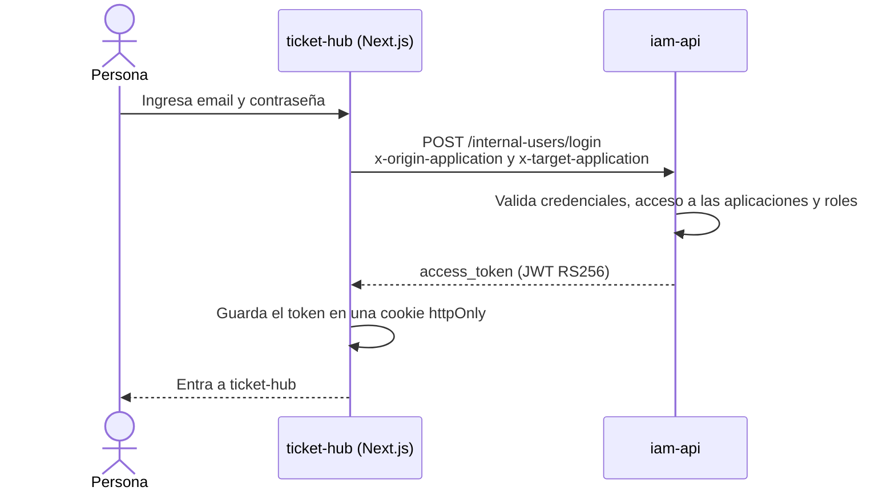
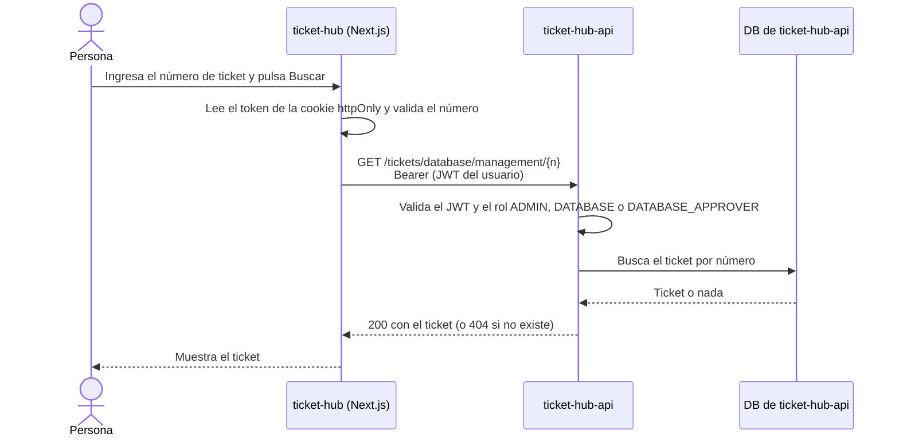

# Buscar ticket de gestión de base de datos

## Login

```mermaid
sequenceDiagram
    actor U as Persona
    participant TH as ticket-hub (Next.js)
    participant IAM as iam-api

    U->>TH: Ingresa email y contraseña
    TH->>IAM: POST /internal-users/login<br/>x-origin-application y x-target-application
    IAM->>IAM: Valida credenciales, acceso a las aplicaciones y roles
    IAM-->>TH: access_token (JWT RS256)
    TH->>TH: Guarda el token en una cookie httpOnly
    TH-->>U: Entra a ticket-hub
```

## Buscar ticket

```mermaid
sequenceDiagram
    actor U as Persona
    participant TH as ticket-hub (Next.js)
    participant API as ticket-hub-api
    participant DB as DB de ticket-hub-api

    U->>TH: Ingresa el número de ticket y pulsa Buscar
    TH->>TH: Lee el token de la cookie httpOnly y valida el número
    TH->>API: GET /tickets/database/management/{n}<br/>Bearer (JWT del usuario)
    API->>API: Valida el JWT y el rol ADMIN, DATABASE o DATABASE_APPROVER
    API->>DB: Busca el ticket por número
    DB-->>API: Ticket o nada
    API-->>TH: 200 con el ticket (o 404 si no existe)
    TH-->>U: Muestra el ticket
```

<a href="ticket-hub.md">← Back</a>

