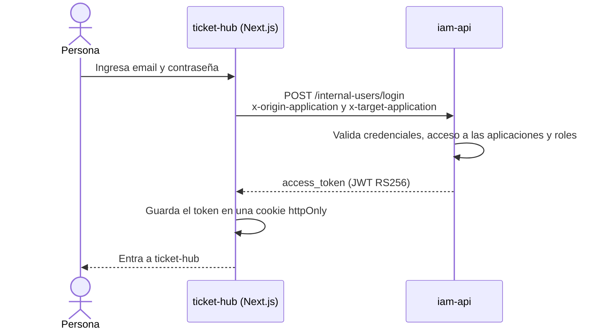
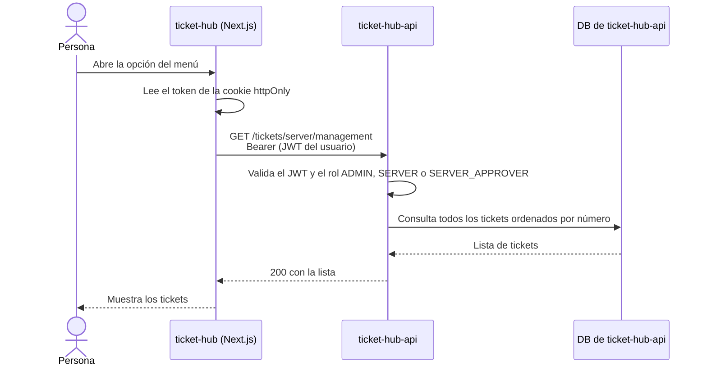

# Ver tickets de gestión de servidor

## Login

```mermaid
sequenceDiagram
    actor U as Persona
    participant TH as ticket-hub (Next.js)
    participant IAM as iam-api

    U->>TH: Ingresa email y contraseña
    TH->>IAM: POST /internal-users/login<br/>x-origin-application y x-target-application
    IAM->>IAM: Valida credenciales, acceso a las aplicaciones y roles
    IAM-->>TH: access_token (JWT RS256)
    TH->>TH: Guarda el token en una cookie httpOnly
    TH-->>U: Entra a ticket-hub
```

## Ver tickets

```mermaid
sequenceDiagram
    actor U as Persona
    participant TH as ticket-hub (Next.js)
    participant API as ticket-hub-api
    participant DB as DB de ticket-hub-api

    U->>TH: Abre la opción del menú
    TH->>TH: Lee el token de la cookie httpOnly
    TH->>API: GET /tickets/server/management<br/>Bearer (JWT del usuario)
    API->>API: Valida el JWT y el rol ADMIN, SERVER o SERVER_APPROVER
    API->>DB: Consulta todos los tickets ordenados por número
    DB-->>API: Lista de tickets
    API-->>TH: 200 con la lista
    TH-->>U: Muestra los tickets
```

<a href="ticket-hub.md">← Back</a>

