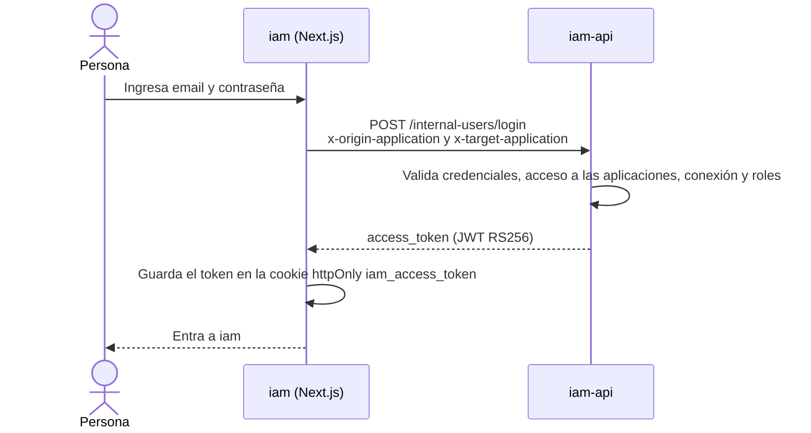
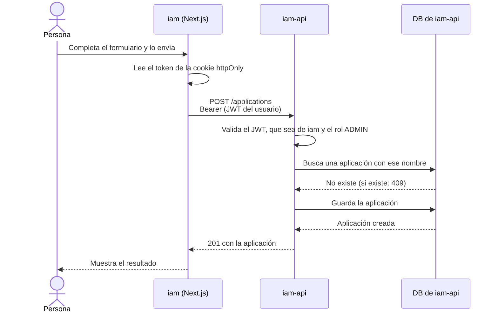

# Crear aplicación

## Login

```mermaid
sequenceDiagram
    actor U as Persona
    participant UI as iam (Next.js)
    participant API as iam-api

    U->>UI: Ingresa email y contraseña
    UI->>API: POST /internal-users/login<br/>x-origin-application y x-target-application
    API->>API: Valida credenciales, acceso a las aplicaciones, conexión y roles
    API-->>UI: access_token (JWT RS256)
    UI->>UI: Guarda el token en la cookie httpOnly iam_access_token
    UI-->>U: Entra a iam
```

## Crear aplicación

```mermaid
sequenceDiagram
    actor U as Persona
    participant UI as iam (Next.js)
    participant API as iam-api
    participant DB as DB de iam-api

    U->>UI: Completa el formulario y lo envía
    UI->>UI: Lee el token de la cookie httpOnly
    UI->>API: POST /applications<br/>Bearer (JWT del usuario)
    API->>API: Valida el JWT, que sea de iam y el rol ADMIN
    API->>DB: Busca una aplicación con ese nombre
    DB-->>API: No existe (si existe: 409)
    API->>DB: Guarda la aplicación
    DB-->>API: Aplicación creada
    API-->>UI: 201 con la aplicación
    UI-->>U: Muestra el resultado
```

<a href="../operation.md">← Back</a>

