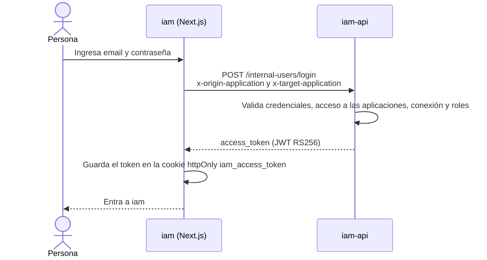
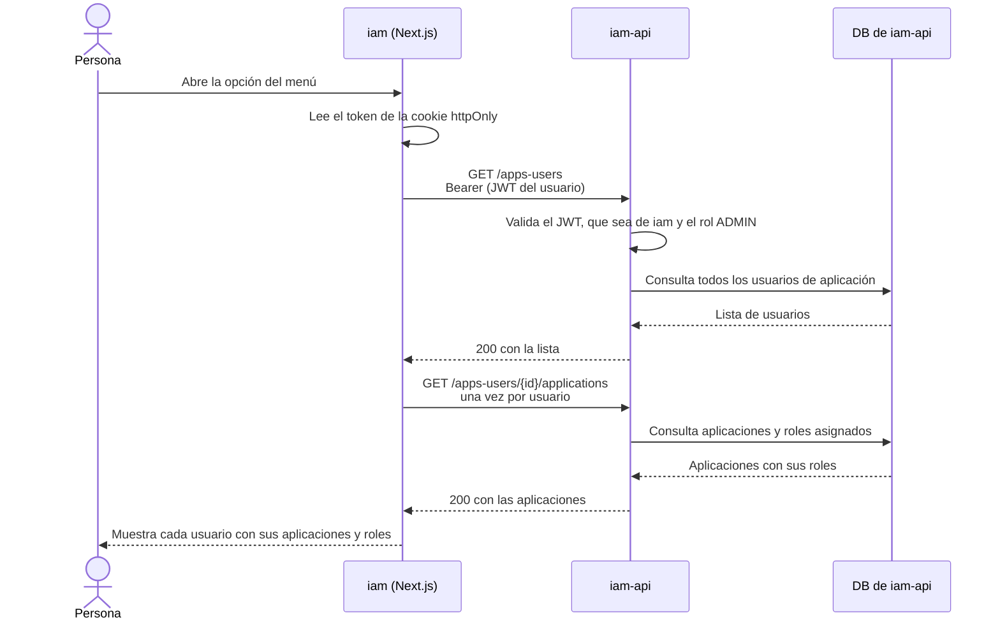

# Ver usuarios de aplicación

## Login

```mermaid
sequenceDiagram
    actor U as Persona
    participant UI as iam (Next.js)
    participant API as iam-api

    U->>UI: Ingresa email y contraseña
    UI->>API: POST /internal-users/login<br/>x-origin-application y x-target-application
    API->>API: Valida credenciales, acceso a las aplicaciones, conexión y roles
    API-->>UI: access_token (JWT RS256)
    UI->>UI: Guarda el token en la cookie httpOnly iam_access_token
    UI-->>U: Entra a iam
```

## Ver usuarios de aplicación

```mermaid
sequenceDiagram
    actor U as Persona
    participant UI as iam (Next.js)
    participant API as iam-api
    participant DB as DB de iam-api

    U->>UI: Abre la opción del menú
    UI->>UI: Lee el token de la cookie httpOnly
    UI->>API: GET /apps-users<br/>Bearer (JWT del usuario)
    API->>API: Valida el JWT, que sea de iam y el rol ADMIN
    API->>DB: Consulta todos los usuarios de aplicación
    DB-->>API: Lista de usuarios
    API-->>UI: 200 con la lista
    UI->>API: GET /apps-users/{id}/applications<br/>una vez por usuario
    API->>DB: Consulta aplicaciones y roles asignados
    DB-->>API: Aplicaciones con sus roles
    API-->>UI: 200 con las aplicaciones
    UI-->>U: Muestra cada usuario con sus aplicaciones y roles
```

<a href="../operation.md">← Back</a>

